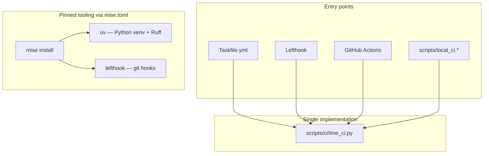

# Agent and contributor pre-flights

This repo uses **four tiers** of checks (one more than a typical Task + bash-hook setup). Pick the tier that matches how much you changed.

## Architecture (vs duplicated shell scripts)



**Why this is better than parallel `.ps1` / `.sh` trees:**

| Piece | Role |
|---|---|
| [`scripts/ci/lme_ci.py`](lme_ci.py) | One cross-platform implementation (stdlib Python 3.10+) |
| [`lefthook.yml`](../lefthook.yml) | Declarative hooks, **parallel** pre-commit, `stage_fixed` auto-staging |
| [`mise.toml`](../mise.toml) | Pins Rust, Python 3.11, uv, lefthook, task — reproducible dev env |
| [`uv`](https://docs.astral.sh/uv/) | Fast venv creation (`uv venv --python 3.11`), no repo-root `.venv` backup dance |
| **Ruff** | `python/tests` + `python/examples` on `task lint`; staged auto-fix on commit |
| **pre-push hook** | Automatic `lint` (Rust + Python) on `git push` |

[`Taskfile.yml`](../Taskfile.yml) is a thin alias layer; it does not duplicate logic.

## 0. One-time setup

```powershell
mise install          # rust, python 3.11, uv, lefthook, task
task setup            # mise install + lefthook install
```

Or install tools manually, then:

```powershell
task hooks:install
```

## 1. On `git commit` (Lefthook — parallel, staged-only)

[`lefthook.yml`](../lefthook.yml) runs only when matching files are staged:

| Staged | Command | Notes |
|---|---|---|
| `**/*.rs` | `fmt` then `clippy` | `stage_fixed: true` re-stages rustfmt fixes |
| `python/**/*.py` | `ruff-staged --fix` | Ruff check + format; auto-stages fixes |

Runs **in parallel** where safe (Ruff vs Rust fmt). Clippy waits on fmt (`priority`).

**Not** on commit: tests, `cargo check`, maturin/pytest.

Bypass once: `git commit --no-verify`.

## 2. On `git push` (Lefthook pre-push)

Runs `lint` (Rust fmt/clippy + Ruff on `python/tests` and `python/examples`) before the push leaves your machine.

Bypass: `git push --no-verify`.

## 3. Before finishing work (manual)

### Quick path

```powershell
task lint
```

Runs Rust (`fmt --check` + clippy) and Python Ruff on `python/tests` and `python/examples`.

If you changed **Python bindings**:

```powershell
task python
```

### Rust-only

```powershell
task rust
```

### Python-only

```powershell
task lint:python
task python
```

Direct runner (no Task):

```powershell
python scripts/ci/lme_ci.py lint
python scripts/ci/lme_ci.py python --reuse-venv
```

## 4. Before PR / large refactors

```powershell
task          # full core CI mirror
task ci:fast  # reuse python/.venv, skip wheel-reinstall pytest
```

Equivalent:

```powershell
python scripts/ci/lme_ci.py ci
python scripts/ci/lme_ci.py ci --reuse-venv --skip-wheel-reinstall
```

**CI-only:** multi-OS matrix, Python 3.10/3.12/3.13, production-load gates, `cargo audit` / `pip-audit`.

## `lme_ci.py` commands

| Command | Purpose |
|---|---|
| `ci` | Full core CI |
| `lint` | Rust + Python static checks |
| `rust-lint` | `fmt --check` + clippy |
| `ruff-lint` | Ruff on `python/tests` + `python/examples` |
| `rust-all` | Rust slice without Python bindings tests |
| `python` | Maturin + pytest (+ wheel pass) |
| `ruff-staged --fix` | Staged Python lint/format |
| `hooks-install` | `lefthook install` |

Run `python scripts/ci/lme_ci.py --help` for the full list.

See also [`CONTRIBUTING.md`](../CONTRIBUTING.md).
