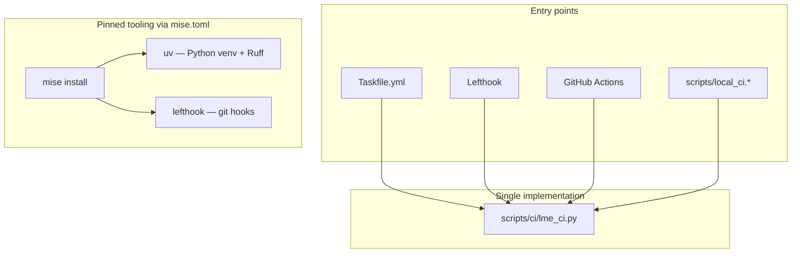

# Agent and contributor pre-flights

This repo uses **four tiers** of checks (one more than a typical Task + bash-hook setup). Pick the tier that matches how much you changed.

## Architecture (vs duplicated shell scripts)



**Why this is better than parallel `.ps1` / `.sh` trees:**

| Piece | Role |
|---|---|
| [`scripts/ci/lme_ci.py`](lme_ci.py) | One cross-platform implementation (stdlib Python 3.10+) |
| [`lefthook.yml`](../lefthook.yml) | Declarative hooks, **parallel** pre-commit, `stage_fixed` auto-staging |
| [`mise.toml`](../mise.toml) | Pins Rust, Python 3.11, uv, lefthook, task — reproducible dev env |
| [`uv`](https://docs.astral.sh/uv/) | Locked Python env (`uv sync` + `uv.lock`); Ruff via `uv tool run` |
| **Ruff** | `python/tests` + `python/examples` on `task lint`; staged auto-fix on commit |
| **pre-push hook** | Automatic `preflight` (lint + `cargo check --all-targets` + `cargo audit` + repo metadata dry-run) |

[`Taskfile.yml`](../Taskfile.yml) is a thin alias layer; it does not duplicate logic.

## 0. One-time setup

```powershell
mise install          # rust, python 3.11, uv, lefthook, task
task setup            # mise install + lefthook install
```

Or install tools manually, then:

```powershell
task hooks:install
```

## 1. On `git commit` (Lefthook — parallel, staged-only)

[`lefthook.yml`](../lefthook.yml) runs only when matching files are staged:

| Staged | Command | Notes |
|---|---|---|
| `**/*.rs` | `fmt` then `clippy` | `stage_fixed: true` re-stages rustfmt fixes |
| `python/**/*.py` | `ruff-staged --fix` | Ruff check + format; auto-stages fixes |
| `comparisons/**/*.R`, `tests/*.R` | `r-format-staged --fix` | **styler** when Rscript + styler are installed; skips otherwise |
| `comparisons/**/*.jl` | `julia-format-staged --fix` | **JuliaFormatter** when julia + JuliaFormatter are installed; skips otherwise |
| `Cargo.toml`, `Cargo.lock`, `python/Cargo.toml`, `python/Cargo.lock` | `cargo check --all-targets` | Catches link/BLAS issues on your platform when manifests change |
| `Cargo.toml`, `scripts/sync_github_repo_metadata.py` | `repo-metadata` dry-run (+ token verify if `REPO_ADMIN_TOKEN` set) | Validates About-box payload before GHA metadata sync |
| `comparisons/**`, benchmark script/workflow | `benchmarks-smoke` | Rust sleepstudy example timing (release build) |

Runs **in parallel** where safe (Ruff vs Rust fmt). Clippy waits on fmt (`priority`); manifest `check` runs after clippy (`priority` 3).

**Not** on commit: full `cargo test`, maturin/pytest, `pip-audit`.

Bypass once: `git commit --no-verify`.

## 2. On `git push` (Lefthook pre-push)

Runs **`preflight`** in parallel with itself as one command:

1. `lint` — Rust fmt/clippy + Ruff
2. `cargo check --workspace --all-targets --locked` — compile graph including tests/examples
3. `cargo audit` — root crate + `python/` (same as GHA audit job, without `pip-audit`)
4. `legal` — fixture provenance plus third-party license metadata and bundled notices
5. `repo-metadata` — dry-run from `Cargo.toml`; **`--verify-token`** when `REPO_ADMIN_TOKEN` is in the environment

Install `cargo-audit` once: `cargo install cargo-audit` (pinned in GHA as 0.22.1).

To catch **expired metadata tokens** before push (optional):

```powershell
$env:REPO_ADMIN_TOKEN = "<fine-grained PAT with Administration: Read and write>"
task repo-metadata
```

If GHA reports `401 Bad credentials` on **Sync Repository Metadata**, rotate the secret: **Settings → Secrets and variables → Actions → `REPO_ADMIN_TOKEN`**.

Bypass: `git push --no-verify`.

**macOS Apple Silicon BLAS** (`openblas-static` vs MKL) is only exercised on `macos-latest` in GHA — Windows/Linux preflights cannot catch that matrix cell. GHA now runs automatically only for `v*` tags (plus manual dispatch), so after changing `Cargo.toml` BLAS target tables or release workflows, run `task ci` locally or manually dispatch the CI workflow before tagging.

**Cross-language benchmarks** (R + Julia, tag-only [`.github/workflows/benchmarks.yml`](.github/workflows/benchmarks.yml)): pre-commit runs `benchmarks-smoke` when `comparisons/**` changes (Rust `sleepstudy` example only). Full matrix needs R (`lme4`, `lmerTest`, `car`, `rlang`, `styler`) and Julia (`JuliaFormatter`) — run it through the tag/manual GHA workflow or `task benchmarks:preflight` with R installed. Comparison script formatting is checked in that GHA job; locally use `task lint:comparisons` (skips when tools are missing) or `task lint:comparisons:required` when R/Julia formatters are installed.

## 3. Before finishing work (manual)

If you changed **LMM fit throughput** ([`src/math.rs`](src/math.rs) intercept path, [`src/optimizer.rs`](src/optimizer.rs) θ search), read **[OPTIMIZATION.md](OPTIMIZATION.md)** and re-run the fair harness cases listed there.

### Quick path

```powershell
task lint
task test:fast   # unit tests only (~seconds after compile)
task preflight   # same as pre-push hook (without pip-audit)
task audit       # full security audit incl. pip-audit
task legal       # provenance and third-party license records
```

Full integration tests: `task test` or `cargo test --locked` (uses `[profile.test] opt-level = 2` in [`Cargo.toml`](Cargo.toml)).

Runs Rust (`fmt --check` + clippy) and Python Ruff on `python/tests` and `python/examples`.

If you changed **Python bindings**:

```powershell
task python
```

### Rust-only

```powershell
task rust
```

### Python-only

```powershell
task lint:python
task python
```

Direct runner (no Task):

```powershell
python scripts/ci/lme_ci.py lint
python scripts/ci/lme_ci.py python --reuse-venv
```

## 4. Before PR / large refactors

```powershell
task          # full core CI mirror
task ci:fast  # reuse python/.venv, skip wheel-reinstall pytest
```

Equivalent:

```powershell
python scripts/ci/lme_ci.py ci
python scripts/ci/lme_ci.py ci --reuse-venv --skip-wheel-reinstall
```

**GHA-only:** multi-OS matrix, Python 3.10/3.12/3.13, production-load gates, and `pip-audit`. These workflows are release-oriented: automatic runs are limited to `v*` tags, with manual dispatch available for pre-release checks.

## `lme_ci.py` commands

| Command | Purpose |
|---|---|
| `ci` | Full core CI |
| `lint` | Rust + Python static checks |
| `preflight` | Pre-push: lint + check + cargo audit + repo metadata |
| `audit` | cargo audit + pip-audit (GHA mirror) |
| `legal` | Third-party notices, fixture provenance, and Rust license metadata |
| `repo-metadata` | Dry-run GitHub About sync; verify token if `REPO_ADMIN_TOKEN` set |
| `benchmarks-smoke` | Release examples + one Rust cross-language benchmark |
| `benchmarks-preflight` | `benchmarks-smoke` + optional `sleepstudy.R` when R/lme4 present |
| `benchmarks-fair-rust-julia` | Fair fit-only Rust vs MixedModels.jl timing (tier-A cases; see [BENCHMARK_COVERAGE.md](../BENCHMARK_COVERAGE.md); skip if Julia/packages missing) |
| `perf-breakdown` | Rust `LME_PERF_DIAG` vs Julia `optsum.feval`; reports `prepare` / `fit_prepared` / cold `lmer` |
| `rust-lint` | `fmt --check` + clippy |
| `ruff-lint` | Ruff on `python/tests` + `python/examples` |
| `comparison-format-check` | Optional styler/JuliaFormatter check on `comparisons/` (+ `tests/*.R`); use `--required` in GHA |
| `r-format-staged --fix` | Staged R comparison/golden-parity scripts |
| `julia-format-staged --fix` | Staged Julia comparison scripts |
| `build-test` | `cargo test` (full suite) |
| `test-fast` | `cargo test --lib` only (quick unit tests) |
| `rust-all` | Rust slice without Python bindings tests |
| `python` | Maturin + pytest (+ wheel pass) |
| `ruff-staged --fix` | Staged Python lint/format |
| `hooks-install` | `lefthook install` |

Run `python scripts/ci/lme_ci.py --help` for the full list.

See also [`CONTRIBUTING.md`](../CONTRIBUTING.md).
