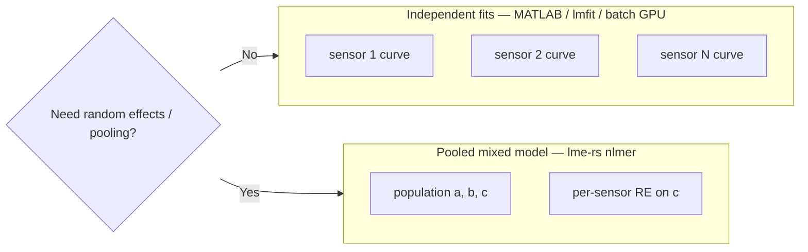

# Calo sensor calibration: workflow choice and CUDA

This document answers **which tool fits which calibration problem** when considering GPU curve fitting (for example [boom-astro/lightcurve-fitting](https://github.com/boom-astro/lightcurve-fitting)) or when the existing pipeline uses MATLAB Curve Fitter `power2` / Python **lmfit**.

**Last updated:** 2026-07-09

---

## Two different problems

| Question | Tool lane | Model |
|:---------|:----------|:------|
| “Fit **one curve per sensor** with bounds, like MATLAB / lmfit?” | **Independent batch NLS** (CPU parallel or optional GPU) | μ = **a·x^b + c** per sensor |
| “**Pool** many sensors and estimate population parameters + per-sensor deviations?” | **`lme-rs` `nlmer`** | `y ~ SSpower(x, a, b, c) ~ c\|sensor_id` |

`lme-rs` is built for the **second** lane. The **first** lane is what CUDA batch fitters target.



---

## Decision checklist

Answer these before choosing a stack:

1. **Random effects?** If each sensor should share population `(a, b, c)` with per-unit variation, use **`nlmer`**. If each sensor is its own fit, use **batch NLS**.
2. **Coefficient bounds?** MATLAB / lmfit support box constraints on `(a, b, c)`. **`nlmer` does not** bound nonlinear parameters today.
3. **How many sensors?** Hundreds to thousands of **independent** fits → CPU parallelism (`rayon`, `std::thread`) or a **dedicated batch GPU** crate. A **single** pooled `nlmer` on tens of sensors → **CPU `lme-rs`** is appropriate; GPU launch overhead usually loses.
4. **Covariate domain?** `SSpower` requires **x > 0** (same as log transforms in MATLAB `power2` heuristics).

| Your pipeline | Recommended approach | In this repo |
|:--------------|:---------------------|:-------------|
| MATLAB `power2` per channel, bounds from pre-scan | lmfit / scipy / future batch fitter | **Out of scope** for `lme-rs` core |
| Many independent `power2` fits, throughput-critical | CPU parallel batch NLS; GPU optional later | [`examples/batch_sspower_cpu.rs`](../examples/batch_sspower_cpu.rs) (CPU demo) |
| Grouped calibration, shared curve + sensor offsets | `nlmer` + `SSpower` | [GUIDE.md § nlmer](../GUIDE.md), [`comparisons/nlmm_sspower.R`](../comparisons/nlmm_sspower.R) |

---

## CUDA and lightcurve-fitting

Projects such as [lightcurve-fitting](https://github.com/boom-astro/lightcurve-fitting) advertise claims such as **“750× faster than parametric CPU”** ([`cuda/gp.cu`](https://github.com/boom-astro/lightcurve-fitting/blob/main/cuda/gp.cu)).

### What that project actually accelerates

- **Parametric:** CUDA **batch particle-swarm** — many **independent** light curves, same model family, on GPU.
- **Nonparametric:** CUDA **batch Gaussian processes** — one GPU block per band/source; threads sweep hyperparameters in parallel.

The headline speedups compare **GPU batch throughput** to **single-thread CPU** fits at scale (hundreds–thousands of sources). They are **not** “GPU `nlmer` vs CPU `nlmer`.”

### Why we do not integrate that CUDA into `lme-rs`

| Reason | Detail |
|:-------|:-------|
| **Wrong math** | Mixed-effects fitting couples all groups through sparse RE algebra; it is not embarrassingly parallel per curve. |
| **Wrong API** | `lme-rs` targets `lme4`-style formulas, not lmfit/MATLAB bounded single-curve NLS. |
| **Engineering cost** | CUDA toolkit, GPU CI, Windows/Linux matrix, optional features — high maintenance for marginal gain on typical `nlmer` sizes. |
| **License** | lightcurve-fitting is **GPL-3.0**; `lme-rs` is **MIT** — cannot copy kernels without a clean-room design or compatible licensing. |
| **CPU already strong** | LMM hot path (`prepare_lmer` + `fit_prepared`) beats Julia on tier-A cases ([OPTIMIZATION.md](../OPTIMIZATION.md)). |

**Do** treat lightcurve-fitting as **inspiration** for a **separate** optional batch curve-fitting crate or service if independent `power2` throughput becomes a product requirement.

### Sensible architecture

```text
Many independent calibrations  →  batch NLS (CPU: rayon / threads; GPU: optional CUDA)  ← lightcurve-fitting-like
Pooled sensors + random effects →  lme-rs nlmer SSpower on CPU                        ← this repository
```

---

## Summary

CUDA batch fitting (e.g. lightcurve-fitting) targets **massively parallel independent curve fits** (astronomy light curves). A calo MATLAB/lmfit workflow is in that camp. `lme-rs` is for **grouped mixed models** when pooling across sensors — a different tool. For 10⁴ single-sensor `power2` fits with bounds, a dedicated batch fitter (CPU parallel first, GPU later) makes sense; bolting third-party CUDA into `nlmer` would not deliver a 750× boost and would blur what this library is for.

---

## `lme-rs` support today (pooled lane)

- Built-in mean **`SSpower`**: μ = `a * x^b + c` (MATLAB Curve Fitter `power2`).
- Formula: `y ~ SSpower(x, a, b, c) ~ c|sensor_id` (random intercept on `c` is a common pattern).
- **`selfStart`** when `start` is omitted (Rust / Python).
- Golden parity: `sspower_synthetic_self_start` in [`tests/data/golden_parity_manifest.json`](../tests/data/golden_parity_manifest.json); R reference via custom `selfStart` in [`comparisons/nlmm_sspower.R`](../comparisons/nlmm_sspower.R).

**Not supported:** coefficient bounds, robust loss, per-sensor independent fits inside `nlmer`.

See also [comparisons/COMPARISONS.md § SSpower](../comparisons/COMPARISONS.md) and [USABILITY.md](../USABILITY.md) (yellow workflow row).

---

## CPU batch demo (independent lane)

[`examples/batch_sspower_cpu.rs`](../examples/batch_sspower_cpu.rs) fits synthetic **one-curve-per-sensor** `power2` models with a small Gauss–Newton solver and `std::thread::scope` parallelism. It prints wall times for batch NLS vs one pooled `nlmer` call on the same synthetic data.

```bash
cargo run --example batch_sspower_cpu --release
```

Run this to sanity-check **which lane dominates** on your machine before investing in GPU batch infrastructure. At large sensor counts (e.g. hundreds of RE levels), pooled `nlmer` wall time can grow much faster than independent batch NLS — see the example output.

---

## Related docs

| Doc | Role |
|:----|:-----|
| [GUIDE.md](../GUIDE.md) | `nlmer` / `SSpower` API |
| [python/PYTHON_GUIDE.md](../python/PYTHON_GUIDE.md) | Python `nlmer` |
| [USABILITY.md](../USABILITY.md) | Workflow traffic light |
| [OPTIMIZATION.md](../OPTIMIZATION.md) | LMM CPU performance (not batch NLS) |
| [comparisons/COMPARISONS.md](../comparisons/COMPARISONS.md) | R parity scope |
